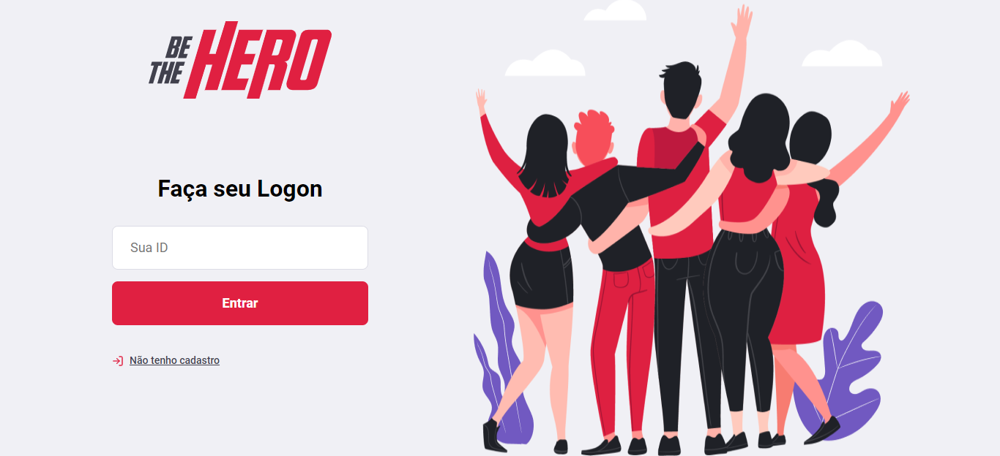
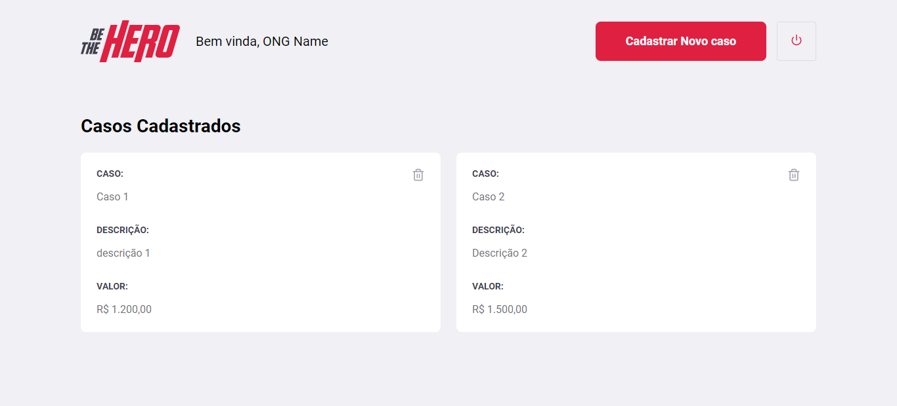
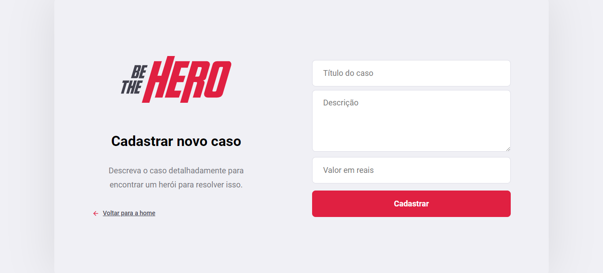
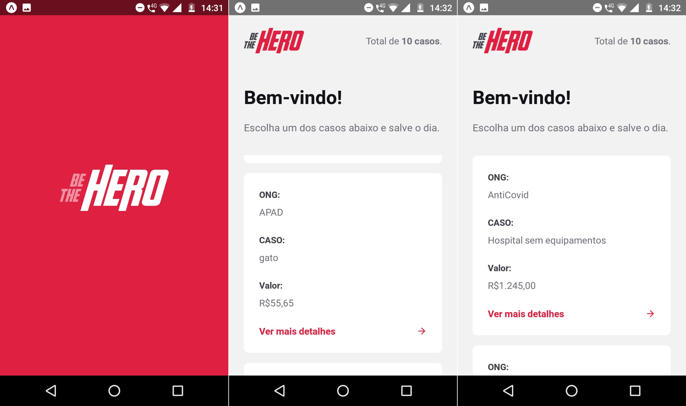
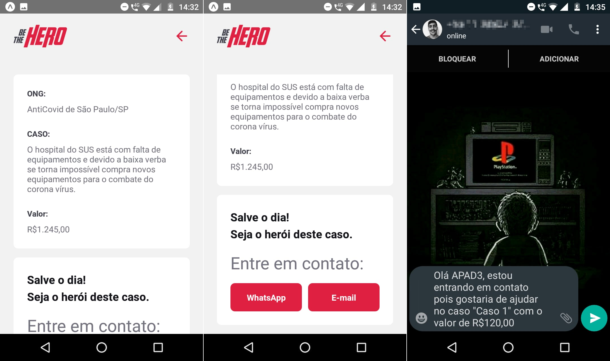

***

## Desafio da Semana Omnistack 11.0
Desenvolvimento Backend, Frontend e Mobile de uma aplicação que conecta pessoas que tenham vontade de ajudar de forma monetária as ONGs que dependam deste auxilio, utilizando de tecnologias como Node.js, ReactJs e React Native

***
 

## Frontend para as ONGs

    
    
    
    

***
 

## Mobile para os heróis

    
    

***
 

## Agradecimento a Rocketseat
Desafio fantastico e de fato levou minha programação a um outro nivel. :rocket: :purple_heart: